# Mobile App — End-to-End Architecture & System Flow

## Architecture Blueprint Before Implementation

> **Purpose:** Define the complete end-to-end architecture for the cross-platform mobile MVP before implementation begins. This document covers system boundaries, technology stack, request/data flow, personalization, feed delivery, journeys, WebView integration, offline behavior, observability, environments, and scalability.
>
> **Architecture principle:** Build the MVP as a simple working prototype with clean boundaries so individual layers can scale independently toward millions of users without requiring a mobile-app rewrite.

---

# 1. Product Architecture at a Glance

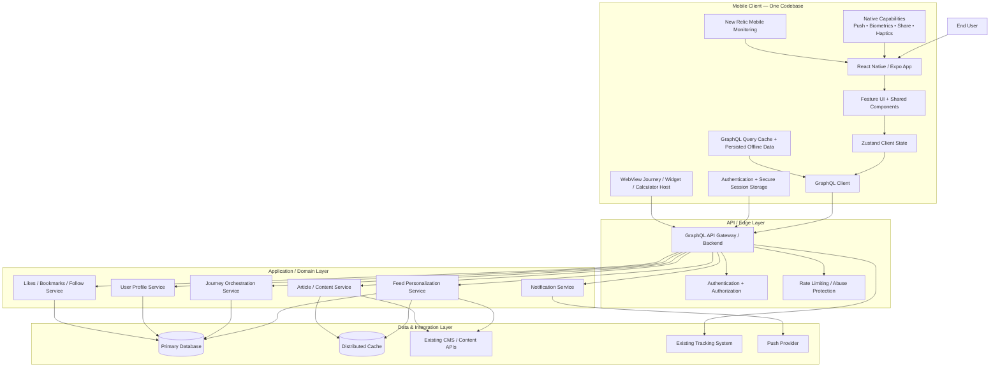

---

# 2. Architectural Decisions

## 2.1 One repository, one primary mobile codebase

The mobile application should use a shared TypeScript codebase for:

- iOS
- Android

The application must avoid separate feature implementations unless a native platform capability genuinely requires it.

Recommended direction:

```text
Monorepo
├── apps/
│   ├── mobile/
│   └── backend/
├── packages/
│   ├── auth/
│   ├── config/
│   ├── graphql/
│   ├── logger/
│   ├── theme/
│   ├── types/
│   └── ui/
└── infrastructure/
```

The existing repository structure should remain the source of truth and be evolved rather than replaced.

---

## 2.2 MVP simplicity with production-grade boundaries

For the MVP:

- One mobile application
- One backend GraphQL boundary
- Mock/rich content where real integrations are not ready
- Simple personalization logic
- Basic authentication
- Offline support for selected capabilities
- Existing web journeys loaded by URL inside the app

For scale:

```text
MVP Monolith
     ↓
Modular Backend
     ↓
Separately Scalable Domain Services
     ↓
Event-Driven / Distributed Components where justified
```

Do **not** start with unnecessary microservices.

---

# 3. Recommended Stack

The final dependency versions must be validated against the repository before installation.

## Mobile

```text
Language:        TypeScript
Framework:       React Native
Runtime/tooling: Expo where compatible with existing project
Navigation:      Existing navigation stack / React Navigation
State:           Zustand
Server state:    GraphQL client/query cache
Animations:      One primary performant animation system
Web content:     Native WebView
```

## Backend

```text
Language:        TypeScript
API:             GraphQL
Architecture:    Modular backend / domain-based modules
Validation:      Schema + input validation
Authentication:  Social login + secure token/session handling
Caching:         Redis-compatible distributed cache
Database:        Relational primary database
```

## Shared

```text
Monorepo:        pnpm workspaces + Turborepo
Linting:         ESLint
Formatting:      Prettier
Typing:          TypeScript
Shared schema:   GraphQL types/code generation where practical
```

## Observability

```text
Mobile:          New Relic
Backend:         New Relic-compatible application monitoring
Errors:          Structured error reporting
Performance:     API latency + mobile performance metrics
```

## Native capabilities

```text
Authentication:  Social provider integration
Biometrics:      Device biometric APIs
Push:            Cross-platform push provider
Share:           Native share sheet
Haptics:         Cross-platform abstraction
Secure storage:  Platform secure storage
```

---

# 4. End-to-End User Entry Flow

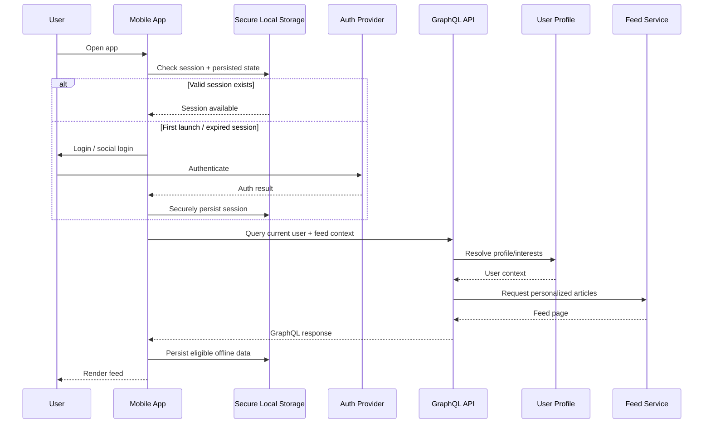

---

# 5. Authentication and Session Architecture

## Required behavior

The user logs in once and remains logged in until:

- Explicit logout
- Session revocation
- Security-related invalidation
- App data is manually erased

## Recommended flow

```text
First App Launch
      ↓
Session Exists?
   ↙       ↘
 Yes        No
  ↓          ↓
Validate    Login
  ↓          ↓
Refresh     Social/Auth Provider
if needed    ↓
  ↓       Secure token/session storage
  └──────────┬───────────┘
             ↓
       Authenticated App
```

## Security requirements

Do not store sensitive tokens in ordinary unencrypted state persistence.

Separate:

```text
Secure data
├── Tokens
├── Refresh credentials
└── Biometric-protected secrets if applicable

Normal persisted app data
├── Feed cache
├── Preferences
├── Journey context
└── Non-sensitive UI state
```

---

# 6. Mobile Application Layering

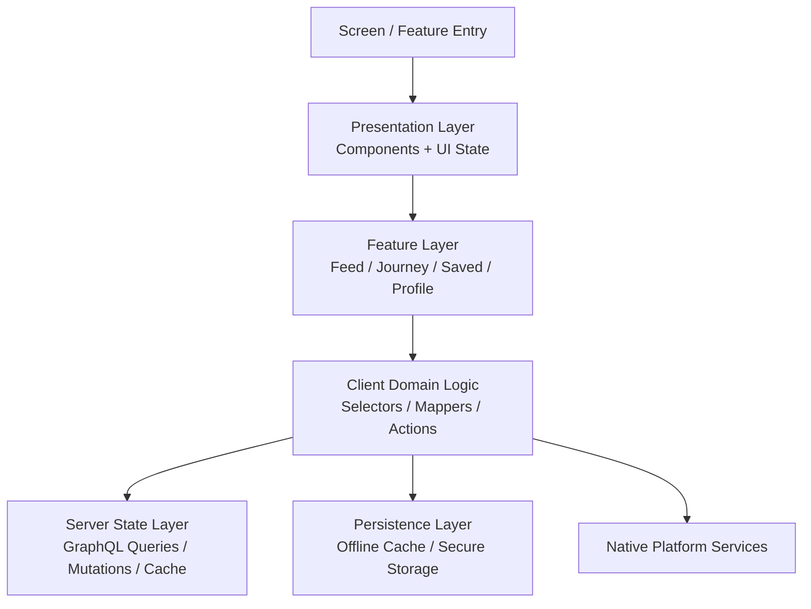

## Rule

UI components should not directly contain:

- Authentication token logic
- Raw API configuration
- Complex personalization rules
- Persistence implementation
- WebView business decisions

Those belong in appropriate feature/domain/service layers.

---

# 7. Feed Architecture

The feed is the central retention engine.

Each article is treated as a personalized feed item.

## Feed request context

The backend can receive or derive:

```ts
type FeedContext = {
  userId: string;
  interests: string[];
  viewedArticles: string[];
  language?: string;
  location?: string;
  device?: string;
};
```

The final production design should minimize sending unnecessary sensitive or redundant data when it can be derived server-side.

## Feed flow

```mermaid
flowchart LR
    A[User Opens Feed]
    B[Read Cached Feed]
    C[Render Immediately]
    D[Request Fresh Feed Page]
    E[Backend Personalization]
    F[Content Retrieval]
    G[Rank / Filter / Deduplicate]
    H[GraphQL Response]
    I[Merge into Client Cache]
    J[Render Next Articles]

    A --> B
    B --> C
    C --> D
    D --> E
    E --> F
    F --> G
    G --> H
    H --> I
    I --> J
```

## Feed algorithm — MVP

Start simple:

```text
Candidate articles
      ↓
Filter viewed / invalid / duplicate
      ↓
Match against user interests
      ↓
Apply basic freshness / diversity rules
      ↓
Return paginated results
```

Do not introduce machine learning into the MVP.

The architecture should allow ranking logic to evolve later.

---

# 8. Infinite Scroll and Pagination

Use cursor-based pagination rather than page-number pagination.

```text
Client
  ↓ first feed query
[Article A, B, C, D]
nextCursor = XYZ
  ↓
User approaches end
  ↓
Query feed(after: XYZ)
  ↓
[Article E, F, G, H]
nextCursor = ABC
```

GraphQL concept:

```graphql
query GetFeed($input: FeedInput!) {
  feed(input: $input) {
    edges {
      cursor
      node {
        id
        title
        description
      }
    }
    pageInfo {
      hasNextPage
      endCursor
    }
  }
}
```

Benefits:

- Better for dynamic datasets
- Better deduplication control
- Better scalable feed behavior
- Avoids unstable page offsets

---

# 9. Article Data Flow

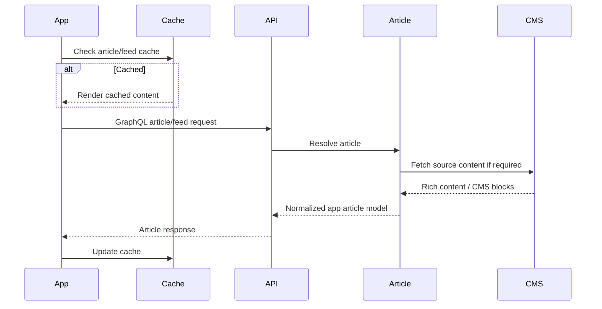

## Normalized article model

The mobile app should not be tightly coupled to every CMS response format.

Prefer:

```text
External CMS format
        ↓
Backend normalization
        ↓
Stable Mobile Article Contract
        ↓
Mobile renderer
```

This prevents CMS changes from directly breaking mobile UI.

---

# 10. Rich Article Rendering

The API may return:

- Rich JSON
- CMS blocks
- Structured paragraphs
- Lists
- KPIs
- Metadata
- Author information

Recommended rendering model:

```ts
type ArticleBlock =
  | { type: "paragraph"; ... }
  | { type: "heading"; ... }
  | { type: "list"; ... }
  | { type: "quote"; ... }
  | { type: "kpi"; ... }
  | { type: "image"; ... };
```

```text
API blocks
   ↓
Block registry
   ↓
Mapped standalone component
   ↓
Native rendering
```

Do not render arbitrary HTML directly unless there is a deliberate security and rendering strategy.

---

# 11. Interaction Data Flow

User actions:

- Like
- Bookmark
- Share
- Follow topic
- Follow author
- Mark article viewed

## Online flow

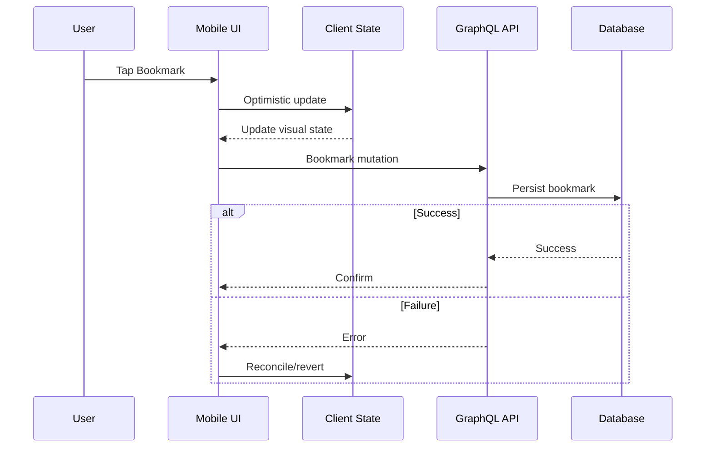

---

# 12. Offline Architecture

MVP offline requirements:

- Read cached articles
- Bookmark offline
- Like offline

## Recommended model

```text
User Action
    ↓
Apply local optimistic state
    ↓
Persist action in offline mutation queue
    ↓
Network available?
   ↙           ↘
 Yes            No
  ↓              ↓
Send mutation     Keep queued
  ↓              ↓
Confirm        Connectivity restored
                  ↓
              Replay queue
                  ↓
              Confirm/reconcile
```

## Important rules

Offline actions must have:

- Unique client operation ID
- Retry strategy
- Idempotent server handling where possible
- Conflict handling
- Queue persistence across app restart where required

Do not silently lose queued bookmarks/likes.

---

# 13. Journey Architecture

A journey is a native orchestration layer around:

- Content
- Milestones
- Existing web experiences
- Calculators
- Widgets
- Conversion points

The mobile app owns:

- When to introduce a journey
- Journey timeline
- Which step is current/next
- Native content around the journey
- Entry and return experience

The web experience owns:

- Its own internal UI and business flow

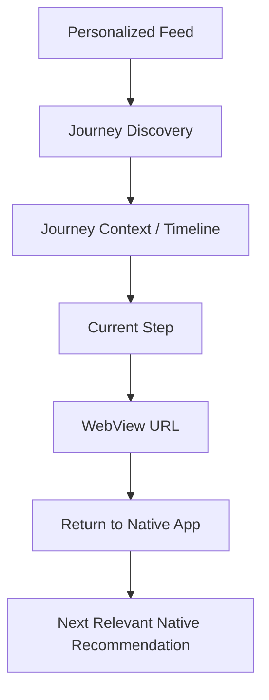

---

# 14. WebView Integration Architecture

For the MVP, the app opens an existing journey/widget/calculator through a URL.

```text
Native Journey Step
      ↓
Validate URL / allowlisted domain
      ↓
Open WebView Screen
      ↓
Show branded native loading bridge
      ↓
Web content loads
      ↓
User interacts with existing Lit / Shadow DOM experience
      ↓
User exits or returns
      ↓
Return to native journey context
```

## Boundary

The mobile app does not initially need to inspect or manipulate the Shadow DOM.

The WebView should be treated as a bounded experience.

## Future evolution

Later:

```text
Web Journey
    ↓ postMessage
Native WebView Bridge
    ↓
Journey Event Handler
    ↓
Update Journey State
    ↓
Personalization / Next Recommendation
```

Do not implement this bridge until the web journeys provide a reliable event contract.

---

# 15. Journey State Model

For the MVP, use truthful lifecycle states.

```text
NOT_STARTED
DISCOVERED
OPENED
CURRENT
NEXT
```

Do not automatically infer:

```text
COMPLETED
```

merely because the WebView was opened.

Future:

```text
Web event
  ↓
Validated event contract
  ↓
Backend journey state update
  ↓
Mobile state refresh
  ↓
Progression unlocked
```

---

# 16. Example Journey Flow — Home

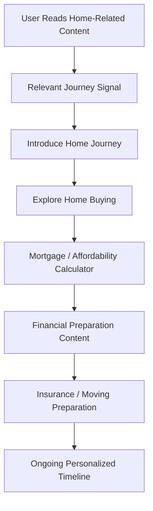

The app's retention value is not one calculator session.

It is:

```text
Different relevant help
at different moments
across the user's real timeline.
```

---

# 17. Example Journey Flow — Debt

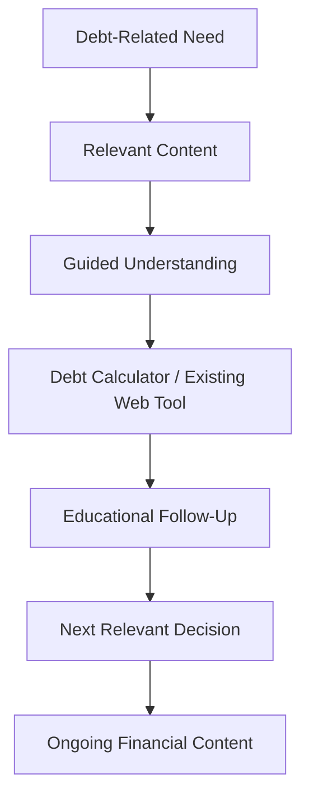

---

# 18. Example Journey Flow — Business / LLC

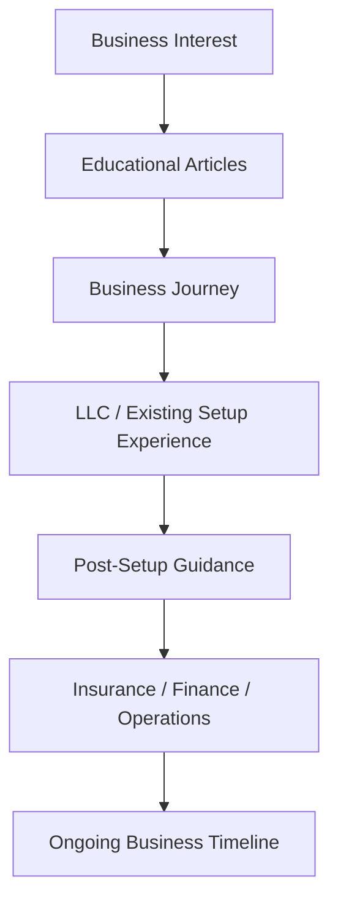

---

# 19. Personalization Architecture

## MVP

Use explicit and behavioral signals.

### Explicit

- Selected interests
- Followed topics
- Followed authors
- Language
- Optional location where justified

### Behavioral

- Viewed articles
- Bookmarks
- Likes
- Journey opened
- Journey state
- Recency

## Data flow

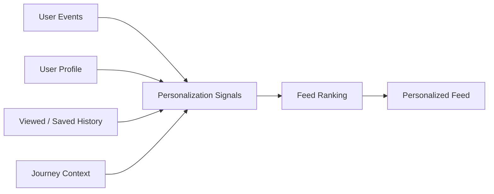

## Future

The ranking component can later evolve independently.

```text
Rules
  ↓
Weighted scoring
  ↓
Experimentation
  ↓
ML-assisted ranking
```

The mobile API contract should remain stable.

---

# 20. Backend Modular Architecture

Start as one deployable backend with clear domain modules.

```text
apps/backend/src/
├── app/
│   ├── bootstrap/
│   └── graphql/
├── modules/
│   ├── auth/
│   ├── users/
│   ├── feed/
│   ├── articles/
│   ├── interactions/
│   ├── journeys/
│   ├── notifications/
│   └── tracking/
├── infrastructure/
│   ├── database/
│   ├── cache/
│   ├── content/
│   └── observability/
└── shared/
```

## Rule

A future microservice extraction should happen only when a real scaling or organizational boundary justifies it.

Potential future candidates:

- Feed ranking
- Notification delivery
- Analytics/event processing
- Content ingestion

Not at MVP initialization.

---

# 21. GraphQL Boundary

The mobile app should communicate primarily through GraphQL.

Example domains:

```text
Queries
├── me
├── feed
├── article
├── savedArticles
├── journeys
└── journeyContext

Mutations
├── login/session flows as appropriate
├── likeArticle
├── bookmarkArticle
├── followTopic
├── followAuthor
├── recordArticleView
└── updateJourneyState
```

The exact schema should be designed from the app contracts, not copied blindly from internal database tables.

---

# 22. Database and Cache Architecture

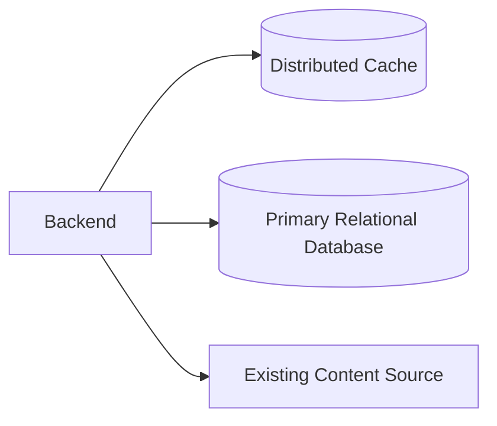

## Database

Stores durable state:

- Users
- Interests
- Bookmarks
- Likes
- Follow relationships
- Viewed history where required
- Journey state
- Device registration where required

## Distributed cache

Stores high-read / expensive-to-compute data:

- Content fragments
- Feed candidates
- User/session-adjacent cached context
- Ranking results where safe
- Frequently accessed metadata

Cache is not the source of truth.

---

# 23. Observability Architecture

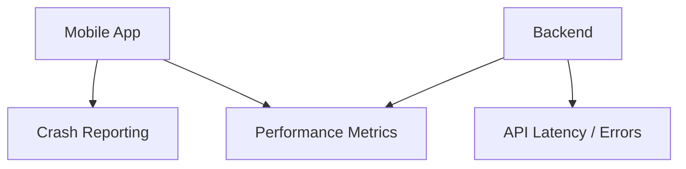

Monitor:

## Mobile

- App launch
- Screen load
- Feed loading
- Slow renders
- WebView load time
- Crashes
- Errors
- Navigation failures

## Backend

- GraphQL latency
- Resolver errors
- Cache hit rate
- Database latency
- Feed generation latency
- External content API failures

Do not instrument personally sensitive data unnecessarily.

---

# 24. Existing Tracking System Integration

Tracking is not MVP-critical but architecture must allow it.

Use a centralized tracking boundary.

```text
Feature
   ↓
Tracking abstraction
   ↓
Existing organization tracking package
   ↓
Tracking platform
```

Do not scatter tracking calls across unrelated UI components.

Example event categories:

- Article viewed
- Article completed/abandoned where definable
- Article liked
- Article bookmarked
- Journey discovered
- Journey opened
- Web experience opened
- Journey returned
- Calculator opened

Future tracking implementation should use the existing user identifier provided by the organization's package.

---

# 25. Push Notification Architecture

Push is enabled architecturally even if the MVP starts minimal.

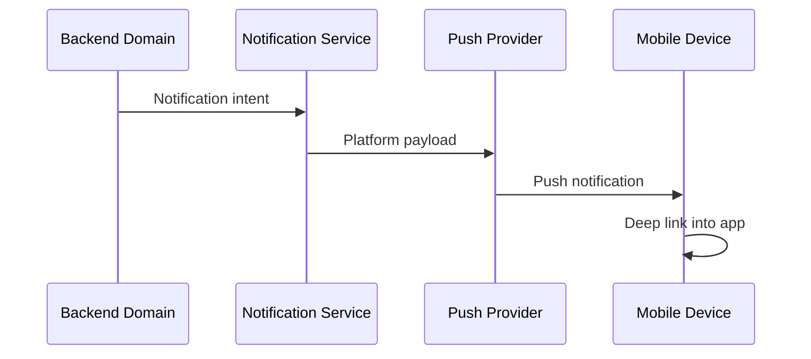

Use notifications for meaningful re-engagement, not constant reminders.

Future examples:

- Journey milestone
- Relevant time-sensitive content
- New content in a followed topic

---

# 26. Environment Architecture

Required environments:

```text
DEV
 ↓
UAT
 ↓
PROD
```

Configuration must be environment-driven.

```text
Environment
├── API endpoint
├── GraphQL configuration
├── Auth configuration
├── Web journey domains
├── New Relic configuration
├── Push configuration
└── Feature flags where introduced
```

Do not hardcode production URLs in feature components.

Use environment-specific configuration packages/files according to existing repository conventions.

---

# 27. Security Boundaries

## Mobile

- Secure token storage
- No secrets committed to repository
- URL allowlisting for WebView
- Validate deep links
- Avoid logging tokens/PII

## Backend

- Authentication
- Authorization
- Input validation
- Rate limiting
- Abuse protection
- GraphQL query safeguards
- Secure environment configuration

## WebView

Only allow approved domains.

```text
Requested URL
     ↓
Allowed domain?
  ↙        ↘
 Yes        No
  ↓          ↓
Open      Block + safe error
```

---

# 28. Performance Architecture

The application must run smoothly on basic devices.

## Mobile

- Virtualized feed
- Cursor pagination
- Bounded in-memory feed data
- Image optimization/caching
- Avoid expensive re-renders
- UI-thread/native-driven animation where available
- Avoid loading too many WebViews simultaneously

## Backend

- Cache frequently requested content
- Batch/avoid N+1 GraphQL operations
- Cursor pagination
- Efficient database indexing
- Bounded feed generation work

---

# 29. End-to-End Request Flow

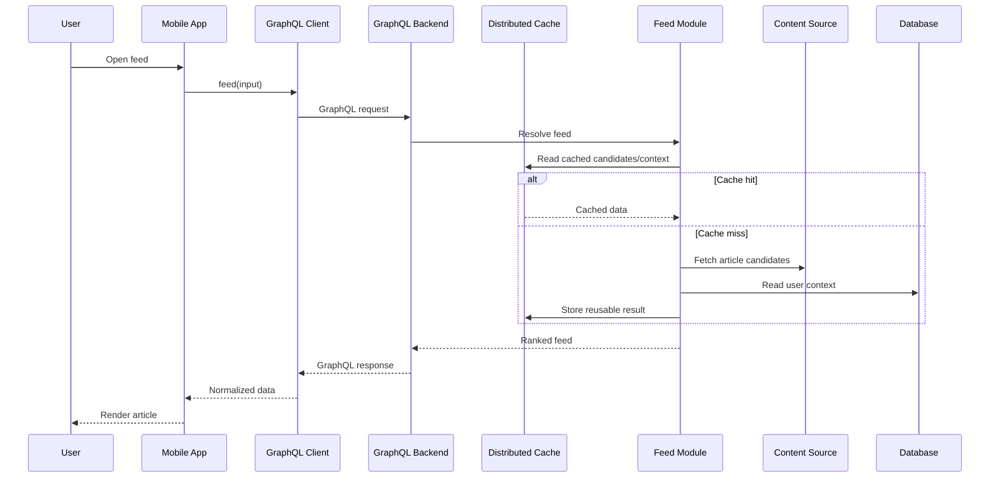

---

# 30. Full System Lifecycle

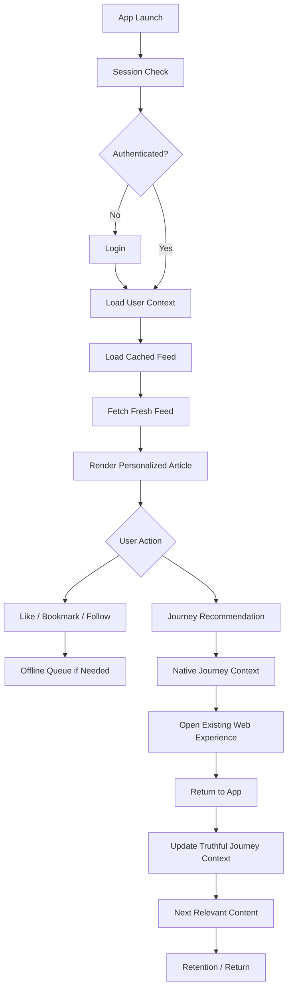

---

# 31. Future Scalability Path

## Stage 1 — MVP

```text
Mobile
   ↓
Single modular GraphQL backend
   ↓
Database + distributed cache
   ↓
Existing content APIs
```

## Stage 2 — Growth

Add when justified:

- Dedicated background workers
- More advanced notification processing
- Event ingestion pipeline
- Feed ranking experiments
- CDN/media optimization

## Stage 3 — Large Scale

Potentially separate:

```text
Feed Ranking Service
Content Ingestion Pipeline
Notification Service
Analytics/Event Pipeline
```

Only extract services based on measurable bottlenecks.

---

# 32. Architecture Principles

1. **One mobile codebase, not two applications.**
2. **One deployable modular backend before microservices.**
3. **GraphQL is the primary mobile API boundary.**
4. **Backend normalizes external content before mobile rendering.**
5. **Mobile owns orchestration and native experience.**
6. **Existing web journeys remain bounded WebView experiences initially.**
7. **Do not falsely infer journey completion.**
8. **Offline actions are durable and replayable.**
9. **Personalization starts rule-based and evolves independently.**
10. **Distributed cache accelerates reads but is not the source of truth.**
11. **Animations must not own business state.**
12. **Observability is built in, not bolted on later.**
13. **Every environment is configuration-driven.**
14. **Scale components independently only when evidence justifies it.**

---

# 33. Recommended Implementation Order

## Phase 0 — Architecture Validation

- Confirm actual mobile stack
- Confirm backend framework
- Confirm GraphQL approach
- Confirm authentication provider
- Confirm database choice
- Confirm Redis/distributed cache
- Confirm WebView domains
- Confirm environment configuration

## Phase 1 — Vertical Slice

Build one complete flow:

```text
Login
  ↓
User context
  ↓
Personalized mock feed
  ↓
Infinite scroll
  ↓
Like/bookmark
  ↓
Open one journey
  ↓
Load one URL in WebView
  ↓
Return to native
```

## Phase 2 — Offline

Add:

- Cached reading
- Offline likes
- Offline bookmarks
- Mutation replay

## Phase 3 — Journey Framework

Add:

- Multiple journeys
- Discovery rules
- Timeline state
- Continue Journey

## Phase 4 — Personalization

Add:

- Better interest weighting
- Behavioral signals
- Diversity rules
- Recommendation experiments

## Phase 5 — Production Hardening

Add:

- Monitoring validation
- Security hardening
- Rate limiting
- Load testing
- Cache tuning
- Push notifications
- Release process

---

# 34. Architecture Decision Checklist Before Coding

The following must be explicitly confirmed before implementation starts:

- [ ] Mobile framework/runtime is identified from the repository
- [ ] Navigation approach is identified
- [ ] GraphQL server technology is selected
- [ ] Primary database is selected
- [ ] Distributed cache technology is selected
- [ ] Authentication provider is selected
- [ ] Session/token strategy is defined
- [ ] Secure storage approach is defined
- [ ] GraphQL client/cache approach is defined
- [ ] Offline mutation queue strategy is defined
- [ ] WebView package/configuration is confirmed
- [ ] Approved WebView domains are known
- [ ] DEV/UAT/PROD configuration strategy is defined
- [ ] New Relic integration path is confirmed
- [ ] Existing tracking package integration boundary is defined
- [ ] Push notification provider is selected
- [ ] Deep-link strategy is defined
- [ ] Feed pagination contract is defined
- [ ] Article contract is defined
- [ ] Journey contract is defined

---

# 35. Cursor Implementation Instruction

When using this document as an implementation guide:

1. Start by inspecting the existing repository.
2. Map the actual repository against this architecture.
3. Do not replace working architecture merely to match this document.
4. Identify every mismatch between the current codebase and the target architecture.
5. Propose the smallest safe implementation path.
6. Build one vertical slice before expanding scope.
7. Stop after every manual milestone.
8. Never proceed to the next milestone without explicit approval.
9. Run available type, lint, test, iOS, and Android checks after every milestone.
10. Report what was actually validated and what was not.

## Required milestone report

```text
MILESTONE:
STATUS: PASS / BLOCKED

ARCHITECTURE IMPLEMENTED:
- ...

SYSTEMS TRAVERSED:
- ...

DATA FLOW:
- ...

FILES CHANGED:
- ...

VALIDATION:
- Type check:
- Tests:
- Lint:
- iOS:
- Android:

KNOWN GAPS:
- ...

NEXT MILESTONE:
- ...

STOPPING FOR MANUAL APPROVAL.
```

---

# Final Architecture Summary

```text
                    USER
                      │
                      ▼
            CROSS-PLATFORM MOBILE APP
          ┌───────────┴───────────┐
          │                       │
          ▼                       ▼
     Native Content          Existing Web Journeys
          │                       │
          │                  WebView Boundary
          ▼                       │
       GraphQL Client ────────────┘
          │
          ▼
    GRAPHQL BACKEND
          │
   ┌──────┼───────────────┐
   ▼      ▼               ▼
 Feed   User/Journey   Interactions
   │      │               │
   └──────┼───────────────┘
          ▼
   Cache + Primary Data
          │
   ┌──────┴───────────┐
   ▼                  ▼
Content Sources   Observability
```

**The architecture starts simple enough to ship an MVP, but every major boundary—mobile, API, personalization, journeys, caching, content normalization, and observability—can scale independently as real usage and bottlenecks emerge.**
